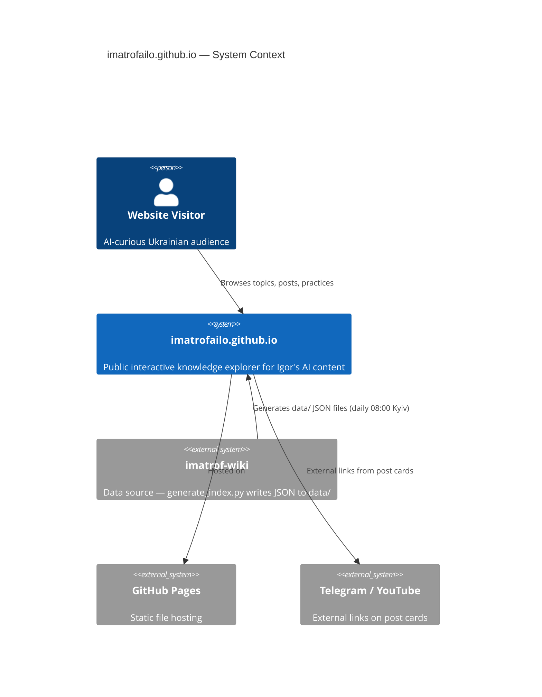
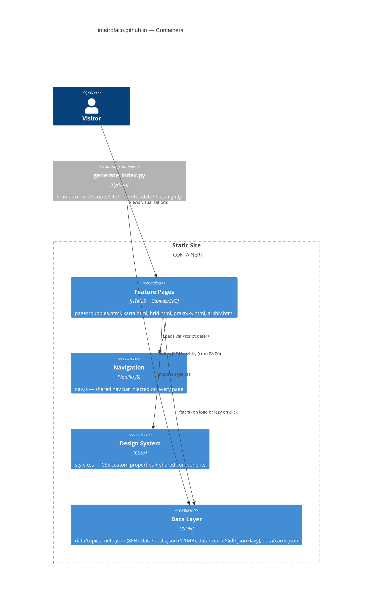

# Architecture Map — imatrofailo.github.io

```
updated_at: 2026-06-21
reflects_commit: 7641072
mode: brownfield
```

## C4 System Context



## C4 Container Diagram



## Module Inventory

| Module | Path | Purpose |
|--------|------|---------|
| Bubble Explorer | `pages/bubbles.html` (528 lines) | Force-directed bubble chart by topic; sidebar with lazy post list |
| Treemap | `pages/karta.html` (456 lines) | Squarified treemap by post count; sidebar detail |
| Waffle Grid | `pages/hrid.html` (265 lines) | One pixel per post; hover tooltip |
| Practice Cards | `pages/praktyky.html` (424 lines) | Curated editorial cards with procedural SVG viz |
| Archive | `pages/arkhiv.html` (429 lines) | Full-text search + multi-filter + pagination over posts.json |
| Navigation | `nav.js` (62 lines) | Shared fixed nav bar; detects current page by filename |
| Design system | `style.css` (73 lines) | CSS custom properties + shared components |
| Fast index | `data/topics-meta.json` | 8KB bootstrap: id, label, category, color, count |
| All posts | `data/posts.json` | 1.1MB — all posts with labels/dates/URLs (Arkhiv) |
| Lazy topics | `data/topics/<id>.json` | Per-topic post list; fetched on sidebar open (Bubbles/Karta) |
| Editorial cards | `data/cards.json` | 23 curated practice cards; manual via `update_cards.py` |
| Legacy index | `data/topics.json` | 1.6MB full topic list (backward compat, not actively used) |
| Redirects | `charts.html`, `tips.html` | 1-line redirects to karta.html / praktyky.html |

## Data Flow per Page

```
Bubbles / Karta / Hrid:
  Page load → fetch data/topics-meta.json → render canvas
  Sidebar click → fetch data/topics/<id>.json → render post list

Arkhiv:
  Page load → fetch data/posts.json (1.1MB) → paginate 20/page
  Input event → filter in JS memory → re-render

Praktyky:
  Page load → fetch data/cards.json → render SVG per card

Navigation (all pages):
  <script defer src="../nav.js"> → builds #site-nav → detects page → sets .active
```

## Design Tokens

Defined in `style.css:1-10`, extended in `DESIGN.md`.

**Color system:**
```css
:root {
  --ivory:  #FAF9F5;   /* page background */
  --paper:  #FFFFFF;   /* card background */
  --slate:  #141413;   /* primary text */
  --oat:    #E3DACC;   /* dividers */
  --clay:   #D97757;   --clay-d: #B85C3E;  --clay-l: #FDF0EB;  /* agents/warm */
  --olive:  #788C5D;   --olive-l: #EEF3E8;                      /* tools/sage */
  --blue:   #4A7CC7;   --blue-l:  #EEF3FC;                      /* products/blue */
  --g100: #F0EEE6;  --g200: #E6E3DA;  --g300: #D1CFC5;
  --g500: #87867F;  --g700: #3D3D3A;
}
```

**Viz palette** (SVG illustrations only, DESIGN.md:96-104):
- `--vr: #C4614A` (brick red — active/final)
- `--vs: #7A8C62` (sage green — intermediate)
- `--vd: #3A3A3A` (dark — structure)
- `--vm: #C5BAB0` (warm gray — inactive)
- `--vl: #E8DFD8` (light — ghost/background)

**Typography** (style.css:7-9):
| Use | Stack | Size |
|-----|-------|------|
| Headlines | `ui-serif, Georgia` | h1: clamp(28-48px); h2: 20-26px |
| Body | `system-ui, Roboto` | 13-15px |
| Tags/labels | `ui-monospace, SF Mono` | 10-11px, weight 600 |

## UI Foundation — Shared Primitives (style.css)

| Component | Class | Notes |
|-----------|-------|-------|
| Page header | `.page-header` | max-width 1100px, grid 1fr auto, border-bottom |
| Card wrapper | `.chart-section` | border + border-radius: 16px |
| Filter pill | `.filter-btn` + `.filter-btn.active` | border-radius 999px; active = slate fill |
| Metric triplet | `.stat` + `.stat-num` + `.stat-label` | numeric display |
| Legend item | `.legend-item` | flex: colored dot + label |
| Loading state | `.loading` | centered 200px height, mono text |
| Segment label | `.seg-agents`, `.seg-coding`, `.seg-tools` | clay/blue/olive backgrounds |
| Responsive | `@media (max-width: 768px)` | single-column, padding 52px → 20px |

## Cross-cutting Conventions

**Page pattern** (`bubbles.html` as canonical template):
1. Import `style.css` + inject `nav.js`
2. Page-level `<style>` block for layout/viz-specific overrides only
3. Fetch `topics-meta.json` on load → render to canvas/DOM
4. Lazy fetch `topics/<id>.json` on interaction
5. Sidebar with overlay backdrop (z-index 400/500), ESC to close

**Naming:**
- Topic IDs: kebab-case (`openai`, `claude-code`, `video-generation`)
- CSS classes: BEM-like (`.card-body`, `.sidebar-head`, `.legend-item`)
- Data fields: snake_case in JSON (`total_posts`, `post_count`, `date`, `url`)
- HTML IDs: kebab-case per feature (`#sidebar`, `#tooltip`, `#bubble-canvas`)

**Error handling** (praktyky.html:419-423):
```js
.catch(() => {
  const loading = document.querySelector('.loading');
  if (loading) loading.textContent = 'Error loading cards';
});
```
Image/data errors fail silently with `.loading` text fallback.

**URL state:** Only `arkhiv.html` preserves filter state via query params (`arkhiv.html:147-170`). Other pages are stateless.

## Precedents

| Precedent | File | Reuse for |
|-----------|------|-----------|
| Interactive Canvas + Sidebar pattern | `pages/bubbles.html` | New visualization pages |
| Procedural SVG rendering | `pages/praktyky.html:73-368` | New viz-heavy editorial pages |
| Full-text search + multi-filter | `pages/arkhiv.html` | Data-heavy filtered views |
| Navigation injection | `nav.js` | Any new page (include `<script defer src="../nav.js">`) |

## Constraints

- **Zero dependencies** — no npm, no framework, no build step (CLAUDE.md:2-89)
- **Daily data update at 08:00 Kyiv** — site reflects previous day's content; near-real-time not possible
- **Canvas rendering is manual** — no D3/Recharts; scaling to >10 topics on one page may need optimization
- **No URL state on interactive pages** — filters/selections are not permalink-able (except Arkhiv)
- **Data generated by imatrof-wiki** — to add new data fields, edit `generate_index.py` in imatrof-wiki
- **Deployment:** Manual git push to GitHub Pages after data update
